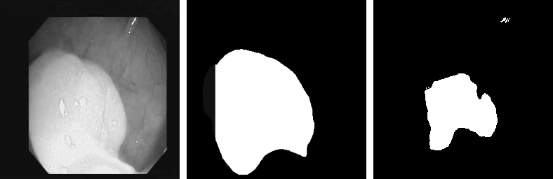
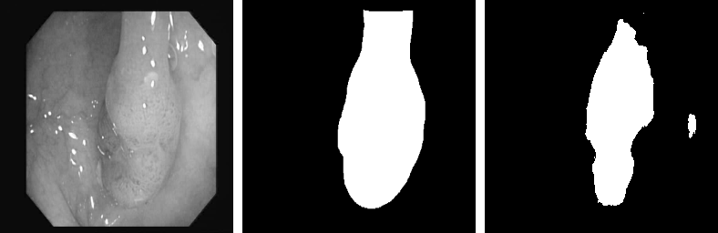
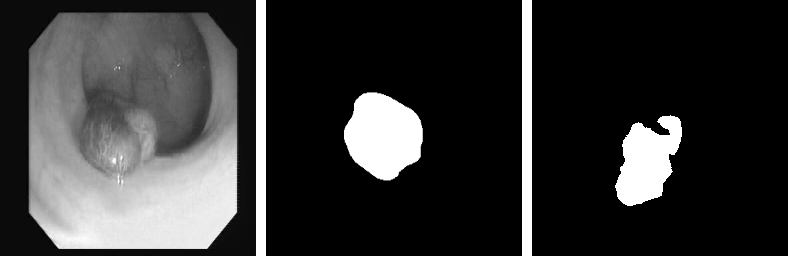

# Polyp Segmentation using UNET

Implementing polyp segmentation using the U-Net and CVC-612 dataset.  

The dataset CVC-ClinicDB (CVC-612) is not complete. Download it from the <a href="https://polyp.grand-challenge.org/CVCClinicDB/"> Here </a> 
# CVC-ClinicDB (CVC-612)

The dataset contains the image extracted from the colonoscopy videos. These image contains different types polyps. The dataset also include the ground-truth for those images.
  

## Results
The images given below are in the sequence: (1) Input Image, (2) Ground Truth, (3) Predicted Mask   

